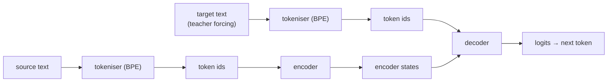

# transformer_from_scratch
[](https://github.com/Uokoroafor/transformer_from_scratch/actions/workflows/ci.yml)

A clean, readable PyTorch implementation of the Transformer architecture from *Attention Is All You Need*, focused on sequence-to-sequence translation. The goal is clarity and correctness, with a workflow that is reproducible and easy to run.

## What This Repo Is

- A reference implementation of encoder-decoder Transformers for EN-FR translation
- A small training pipeline with tokeniser training and evaluation
- A lightweight test suite that checks core tensor contracts and masking behaviour

It is not a framework or a production package. The emphasis is a tidy, readable reference project.

## Setup

```bash
git clone https://github.com/Uokoroafor/transformer_from_scratch
cd transformer_from_scratch
uv sync --dev
```

If you do not already have `uv` installed:

```bash
curl -LsSf https://astral.sh/uv/install.sh | sh
```

## Usage

The default workflow uses a local preset designed to finish in 1-2 hours on a laptop.

First, download and split a capped Europarl FR-EN dataset:

```bash
uv run python examples/download_data.py
```

By default this uses the `local` preset:

- 50,000 training sentence pairs
- 2,000 validation sentence pairs
- 2,000 test sentence pairs

Then train with the matching local preset:

```bash
uv run python examples/train_fr_en.py
```

Checkpoints and logs are written under `data/europarl_fr_en/training/<run_id>/` with:

- `saved_models/Transformer_best_model.pt`
- `training_logs/training_log.txt`

The default `local` training preset is intentionally smaller than the full baseline:

- 5 epochs
- `batch_size=16`
- `max_seq_len=64`
- `d_model=256`
- `d_ff=1024`
- 4 layers
- 4 heads
- `tokeniser_epochs=20`

Use this when you want a result in 1-2 hours rather than running the full corpus.

If you want the larger baseline settings instead, use the `benchmark` preset for both data prep and training:

```bash
uv run python examples/download_data.py --preset benchmark
uv run python examples/train_fr_en.py --preset benchmark
```

Common training overrides on top of the local preset:

```bash
uv run python examples/train_fr_en.py \
  --num-epochs 3 \
  --batch-size 8 \
  --max-seq-len 64 \
  --tokeniser-epochs 20
```

Translate a sentence with a trained checkpoint:

```bash
uv run python examples/translate_fr_en.py \
  --checkpoint /path/to/your_model.pt \
  --text "The way around an obstacle is through it."
```

Run the tests:

```bash
uv run pytest
```

## Common Commands

If you prefer Make targets:

```bash
make setup
make test
make lint
make download-data
make train
make translate
```

## Project Structure

```text
├── blocks
├── embeddings
├── examples
│   ├── data_prep.py
│   ├── download_data.py
│   ├── train_fr_en.py
│   └── translate_fr_en.py
├── layers
├── models
├── tests
├── utils
├── pyproject.toml
└── README.md
```

## Architecture Overview



## Design Notes

The implementation is intentionally small and explicit. I chose post-norm to stay close to the original paper and to keep the layer flow easy to trace. The custom BPE tokeniser (`utils/tokeniser.py`) keeps the data pipeline self-contained and avoids external tokenisation dependencies. Masking is handled directly in the model code so the behaviour is transparent and easy to test. The training and translation entrypoints are minimal CLIs that keep configuration in one place and make the workflow reproducible without introducing framework complexity.

## Limitations

- The translation script uses greedy decoding only and does not implement beam search.
- There is no config file format yet, only CLI flags.
- The data pipeline requires the Europarl corpus to be downloaded and split locally first (see `examples/download_data.py`).
- Training results are not yet benchmarked.

## Results Snapshot

Latest local run:

| Preset | Device | Epochs | Final train loss | Final val loss | Notes |
|---|---|---:|---:|---:|---|
| `local` | `mps` | 5 | 1.1407 | 1.0595 | Best checkpoint saved each epoch |

Example translation using `data/europarl_fr_en/training/260304-0858/saved_models/Transformer_best_model.pt`:

- Input: `The way around an obstacle is through it.`
- Output: `le trouve aujourd'hui est une chose.`

## References

- [Attention Is All You Need](https://arxiv.org/abs/1706.03762)
- [The Annotated Transformer](https://nlp.seas.harvard.edu/2018/04/03/attention.html)
- [The Illustrated Transformer](http://jalammar.github.io/illustrated-transformer/)

## Licence

MIT. See `LICENSE`.
