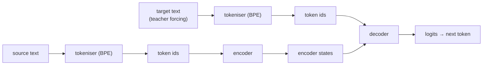

# transformer_from_scratch

A clean, readable PyTorch implementation of the Transformer architecture from *Attention Is All You Need*, focused on sequence-to-sequence translation. The goal is clarity and correctness, with a workflow that is reproducible and easy to run.

## What This Repo Is

- A reference implementation of encoder-decoder Transformers for EN-FR translation
- A small training pipeline with tokeniser training and evaluation
- A lightweight test suite that checks core tensor contracts and masking behaviour

It is not a framework or a production package. The emphasis is a tidy, readable reference project.

## Setup

```bash
git clone https://github.com/Uokoroafor/transformer_from_scratch
cd transformer_from_scratch
uv sync
```

If you do not already have `uv` installed:

```bash
curl -LsSf https://astral.sh/uv/install.sh | sh
```

## Usage

Train on Europarl EN-FR:

```bash
uv run python examples/train_fr_en.py
```

Common training overrides:

```bash
uv run python examples/train_fr_en.py \
  --num-epochs 5 \
  --batch-size 16 \
  --max-seq-len 64 \
  --tokeniser-epochs 50
```

Translate a sentence with a trained checkpoint:

```bash
uv run python examples/translate_fr_en.py \
  --checkpoint /path/to/your_model.pt \
  --text "The way around an obstacle is through it."
```

Run the tests:

```bash
uv run pytest
```

## Project Structure

```text
├── blocks
├── embeddings
├── examples
│   ├── data_prep.py
│   ├── train_fr_en.py
│   └── translate_fr_en.py
├── layers
├── models
├── tests
├── utils
├── pyproject.toml
└── README.md
```

## Architecture Overview



## Design Notes

The implementation is intentionally small and explicit. I chose post-norm to stay close to the original paper and to keep the layer flow easy to trace. The custom BPE tokeniser (`utils/tokeniser.py`) keeps the data pipeline self-contained and avoids external tokenisation dependencies. Masking is handled directly in the model code so the behaviour is transparent and easy to test. The training and translation entrypoints are minimal CLIs that keep configuration in one place and make the workflow reproducible without introducing framework complexity.

## Limitations

- The translation script uses greedy decoding only and does not implement beam search.
- There is no config file format yet, only CLI flags.
- The data pipeline assumes pre-split Europarl files on disk.
- Training results are not yet benchmarked.

## References

- [Attention Is All You Need](https://arxiv.org/abs/1706.03762)
- [The Annotated Transformer](https://nlp.seas.harvard.edu/2018/04/03/attention.html)
- [The Illustrated Transformer](http://jalammar.github.io/illustrated-transformer/)

## Licence

MIT. See `LICENSE`.
